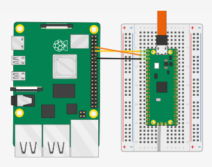

# pico-hid

Python package to control pico spoofed as keyboard/mouse via serial pins (uart)

## Installation

1. Boot pico into bootloader mode.
1. Download `pico-hid.uf2` from https://github.com/sandbox-pokhara/pico-hid-firmware/releases.
1. Copy `pico-hid.uf2` firmware to pico.
1. Connect pico to a controller device (a raspberry pi zero, raspberry pi 3, raspberry pi 4, pc with uart to usb, etc) via UART pins and target device via USB.

   

1. Install `pico-hid` to the controller device.
   ```
   pip install pico-hid
   ```

## Usage

```python
from pico_hid import keyboard
from pico_hid import mouse

mouse.move(100, 100)
mouse.click()

keyboard.press("control_left")
keyboard.press_and_release("a")
keyboard.release("control_left")
keyboard.write("hello world")
```

## License

This project is licensed under the terms of the MIT license.

## Contributing

Pull requests are welcome. For major changes, please open an issue first to discuss what you would like to change.

## Contact

If you want to contact me you can reach me at pradish@sandbox.com.np.
